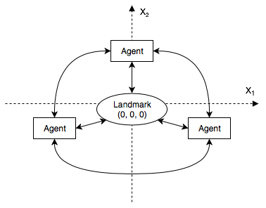

# netloc - network locator

Latency-based network coordinate system for overlays.

## Overview
Netloc is implementation of Vivaldi network coordinate system approach according to the the classical paper:

> Russ Cox, Frank Dabek, Frans Kaashoek, Jinyang Li, and Robert Morris. 2004. Practical, distributed network coordinates. SIGCOMM Comput. Commun. Rev. 34, 1 (January 2004), 113-118.

In short, one can deploy netloc-daemons (agents) on the servers across the network and get the map of nodes in RTT-based coordinate system, updated in real-time.

Comprehensive description and details could be found in the original paper.


### Overlay
Each netloc-driven overlay includes single mandatory infrastructure node called *landmark* and (reasonably) unlimited number of server nodes called *agents*. Landmark node operates as both a bootstrap server and a fixed zero point in the overlay's coordinate system. Agents periodically communicate with other agents and the landmark, measuring RTT and computing its positions in overlay.

### Network coordinates



Coordinate space is constructed with special non-euclidean metric, consisting of two linear dimensions denoted as`X1`, `X2` and additional height dimension `h`. For any two points with coordinates `p1(X1_1, X2_1, h_1)` and `p2(X1_2, X2_2, h_2)` distance  in given metric space could be computed as follows:

`D(p1, p2) = sqrt[(X1_1 - X1_2)^2 + (X2_1 - X2_2)^2] + h_1 + h_2`

Distance between two agents in overlay coordinate space is approximately equivalent to RTT between given pair of nodes in seconds (assuming that communication channels are symmetric in bandwidth).


#### Protocol

Agents communicate with each other and landmark node with custom binary protocol over UDP. There are basically just two types of messages: request and response. Each request contains information about its sender and timestamp of transmission.
It is a RTT-probe and should naturally fit into typical MTU. Response return back original timestamp and respondent's information.

Agents disseminate information about its neighbours inside the probe packets via gossip-like protocol. Thus receiving both request or response agent will get information about several random neighbours of its party. So full overlay view would be available to each agent in a logarithmic time.


## Usage

### Build

Building the project requires Rust toolchain to be installed.

```
cd netloc
cargo build --release
```

There will be two binaries in target directory after build process completion: `landmark` and `agent`.

### Run
At first run landmark node on host `10.0.0.1`:

```
landmark --log debug --addr 10.0.0.1 --port 3738
```

Now start agents on separate nodes (e.g. `10.0.0.2` and `10.0.0.3`) giving it address of landmark for bootstrap:

```
# agent --name <first agent name> --addr 10.0.0.2 --port 5001 10.0.0.1:3738
# agent --name <second agent name> --addr 10.0.0.3 --port 5001 10.0.0.1:3738
```

*Note*: agent's names are optional and used only for convenience.

After finishing bootstrap process agents will periodically probe its neighbours in random order and measure corresponding latencies. In case of relatively stable network RTT-based map of overlay will start to converge during measurements.


### Agent interface
Collected information about overlay could be obtained from agent via informational interface. By default interface server is listening on `127.0.0.1:4001`.

Clients could communicate with interface in a request-response manner using newline-delimited JSON messages. Each request specifies *action*, and there are four types of actions currently supported:

* `get_location`
* `get_node_info`
* `get_recent_nodes`
* `get_full_map`


#### `get_location`
Request for the coordinates of local agent:

```
# request
{"action": "get_location"}

# response
{
  "type":"location",
  "loc":{
    "x1":10.000018983832,
    "x2":5.00031173512,
    "height":0.117797026,
    "pos_err":0.11417916,
    "iteration":26
  }
}
```

Iteration practically shows number of coordinate measurement.


#### `get_node_info`
Get information about some agent participating in the overlay, specifying it with IP-address and port.

```
# request
{"action": "get_node_info", "node_addr": "10.0.0.2:5001"}

# response
{
  "type":"node_info",
  "info":{
    "ip":"10.0.0.2",
    "port":5001,
    "name":"first",
    "location":{
      "x1":0.016265049,
      "x2":0.026708987,
      "height":0.010629633,
      "pos_err":0.0761579,
      "iteration":116
    },
    "updated_at":1531952897
  }
}
```

#### `get_recent_nodes`
Return information about agents with most recent updates.

```
# request
{"action": "get_recent_nodes", "max_nodes": 1}

# response
{
  "type":"recent_nodes",
  "nodes":[
    {
      "flags":{"is_addr_ipv6":false},
      "ip":"127.0.0.1",
      "port":5002,
      "name":"second",
      "location":{
        "x1":0.00002392113,
        "x2":0.0003928111,
        "height":0.000102382975,
        "pos_err":0.4803636,
        "iteration":158
      }
    }
  ]
}
```

Parameter `max_nodes` is optional, by default agent will return 10 most recently updated neighbours.


#### `get_full_map `
Returns full view of overlay network as seen by the local agent (excluding this agent).

```
# request
{"action": "get_full_map"}

# response
{
  "type":"full_map",
  "nodes":[
    {
      "flags":{"is_addr_ipv6":false},
      "ip":"10.0.0.2",
      "port":5001,
      "name":"first",
      "location":{
        "x1":1.18983832,
        "x2":1.31173512,
        "height":0.0117797026,
        "pos_err":0.2587673,
        "iteration":25
      }
    },
    {
      "flags":{"is_addr_ipv6":false},
      "ip":"10.0.0.3",
      "port":5001,
      "name":"second",
      "location":{
        "x1":0.22890863,
        "x2":-1.237589294,
        "height":0.0152138705,
        "pos_err":0.26000264,
        "iteration":23
      }
    }
  ]
}
```

## Disclaimer
Project is under development and may change significantly.
